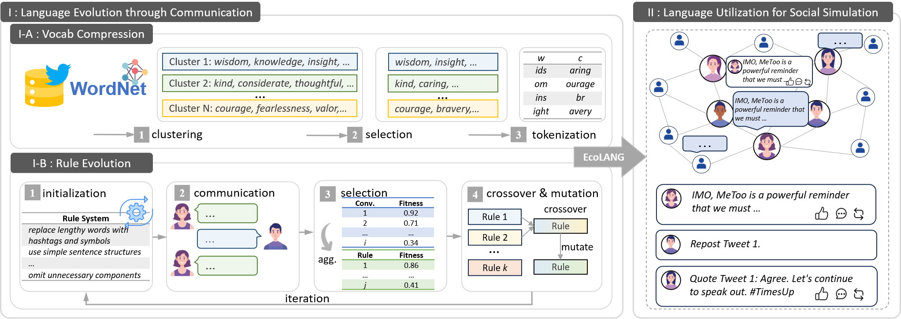

# ♻EcoLANG: Efficient and Effective Agent Communication Language Induction for Social Simulation

This repository is the implementation of our paper [EcoLANG: Efficient and Effective Agent Communication Language Induction for Social Simulation]().   


## 🚀Contents
- [Abstract](#Abstract)
- [Dataset](#Dataset)
- [Getting Started](#Getting-Started)
    - [Installation](#Installation)
    - [Evolution](#Evolution)
    - [Simulation and Evaluation](#Simulation-and-Evaluation)
- [Citation](#Citation)

## 💡Abstract
Large language models (LLMs) have demonstrated an impressive ability to role-play humans and replicate complex social dynamics. While large-scale social simulations are gaining increasing attention, they still face significant challenges, particularly regarding high time and computation costs. Existing solutions, such as distributed mechanisms or hybrid agent-based model (ABM) integrations, either fail to address inference costs or compromise accuracy and generalizability. To this end, we propose **EcoLANG**: Efficient and Effective Agent Communication Language Induction for Social Simulation. EcoLANG operates in two stages: (1) language evolution, where we filter synonymous words and optimize sentence-level rules through natural selection, and (2) language utilization, where agents in social simulations communicate using the evolved language. Experimental results demonstrate that EcoLANG reduces token consumption by over 20%, enhancing efficiency without sacrificing simulation accuracy.

## 📊Dataset
### Language Evolution
Language evolution is conducted on the dev set of [Synthetic-Persona-Chat](https://huggingface.co/datasets/google/Synthetic-Persona-Chat) dataset. 

### Social Simulation
Social simulation is validated on [PHEME](https://aclanthology.org/C18-1288/) and Metoo & Roe movements of [HiSim](https://aclanthology.org/2024.findings-acl.285/) dataset.

- PHEME: To effectively observe the communication (content), we preserved the reactions in each thread of PHEME and removed replies that could not reconstruct the propagation chain (i.e., tweets that could not be matched to a parent tweet). This resulted in retaining 196 threads (i.e., 196 scenarios), which were then formatted for OASIS simulation. See `./data/pheme` for the processed data.
- HiSim: Due to the Twitter's terms of service, we can not release the raw text data or the user data. Please contact the author (via xymou20@fudan.edu.cn) if you need the processed data in the OASIS simulation format.

## 🏃‍♂️Get Started
### Installation
EcoLANG requires three conda environments:
- ecolang-vllm: for vLLM deployment;
- ecolang-evo: for language rule evolution; 
- ecolang-simu: for validation of social simulation.  
*To support custom vocabulary for generation, modifications need to be made to parts of the vllm, camel and oasis code. Please refer to the following two tar archive files (`./pkg`).*

---------

- for llm serving
```bash
conda create -n ecolang-vllm python=3.10
conda activate ecolang-vllm
pip install -r requirements_vllm.txt
# install vllm 0.6.4.post2.dev394+g2bfdbf2a
# If you cannot find this version of vllm package, try to unzip the vllm pkg of ./pkg in the path of site-packages of ecolang-vllm env. You can run 'pip show pip' to find the path.
# cd pkg
# unzip vllm.zip -d /opt/miniconda3/envs/ecolang-vllm/lib/python3.10/site-packages/
# prepare self-defined logits_processor
cd pkg/logits_processors
pip install -e .
```

- for language evolution (simulation based on conversations using AutoGen)
```bash
conda create -n ecolang-evo python=3.10
conda activate ecolang-evo
git clone https://github.com/xymou/EcoLANG.git
cd EcoLANG
pip install -r requirements_evo.txt
# prepare self-defined logits_processor
cd pkg/logits_processors
pip install -e .
```

- for simulation (simulation based on OASIS)
```bash
conda create -n ecolang-simu python=3.10
conda activate ecolang-simu
cd EcoLANG
pip install -r requirements_simu.txt
# install oasis
cd pkg
unzip oasis.zip
cd oasis
pip install -e .
# install camel
cd ..
# unzip the camel pkg of ./pkg in the path of site-packages of ecolang-simu env.
# unzip -o camel.zip -d /opt/miniconda3/envs/ecolang-simu/lib/python3.10/site-packages/
# prepare self-defined logits_processor
cd logits_processors
pip install -e .
```

- structure
```bash
EcoLANG/
│
├── configs/ # overall configs of simulation
├── scene_configs/ # config files of each scenario of a dataset 
├── data/ # dataset
├── rules/ # initialized and evolved rules
├── pkg/ # modified vllm, camel and oasis code for this work
└── code/ 
    ├── scripts/ # sh command set for simulation
    ├── run_evolution.py # main file of language evolution
    ├── prepare_config.py # prepare configs for each scenario
    ├── chat_simulation.py # chat simulation for language evolution
    ├── diversification.py # cross and mutation in the evolution
    ├── myselect.py # evaluation and selection in the evolution
    ----------------------
    ├── run_oasis_eval.py # main file of social simulation of PHEME        
    ├── run_oasis_hisim_eval.py # main file of social simulation of HISIM
    ├── twitter_simulation.py # start an OASIS simulation of a single scenario in PHEME
    ├── twitter_simulation_hisim.py # start an OASIS simulation of a single scenario in HISIM
    ├── collect_simu_res.py # collect simulation result
    └── evaluation_prl.py # evaluation protocol of each dataset
```


### Evolution
Evolve the language rules through simulations of syn-persona-chat dataset. Here are some examples showing how to run the code.  
Remember to give your `base_url` and `api_key` in the scripts.

- serve the LLMs using vLLM
```bash
conda activate ecolang-vllm
cd code
bash scripts/local_sevrer_vllm.sh
```

- run the evolution code
```bash
conda actiavte ecolang-evo
cd code
bash scripts/evo_persona_hisim_vocab.sh
```


### Simulation and Evaluation
- serve the LLMs using vLLM
```bash
conda activate ecolang-vllm
cd code
bash scripts/local_sevrer_vllm.sh
```

- run the simulation code
```bash
conda activate ecolang-simu
cd code
bash scripts/run_hisim_vocab_topdown_rule.sh # run ecolang (vocab+rule)
bash scripts/run_pheme_vocab_topdown_rule.sh # run ecolang (vocab+rule)
```

The evaluation process will be carried out in the simulation code above. More details can be found in code/evaluation_prl.py  
Remember to give your `base_url` and `api_key` in the scripts.


## ✍️Citation
Please consider citing this paper if you find this repository useful:
```bash

```